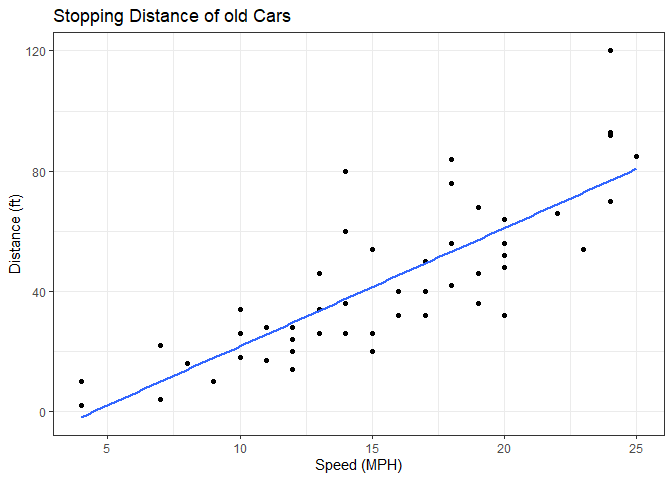
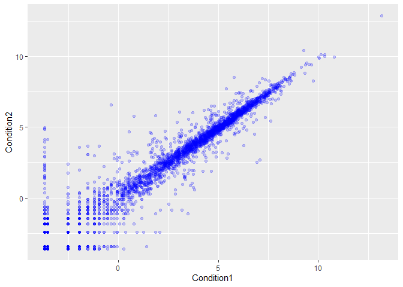
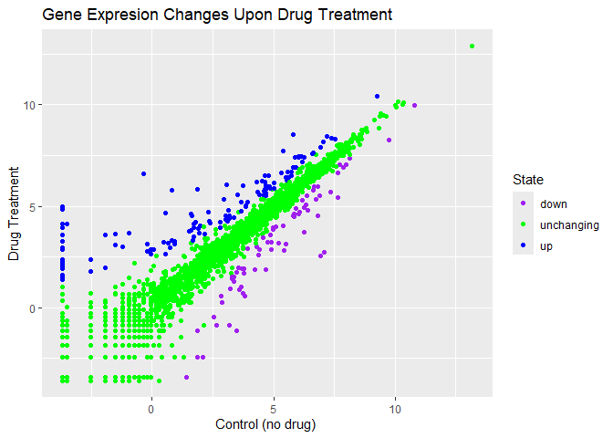
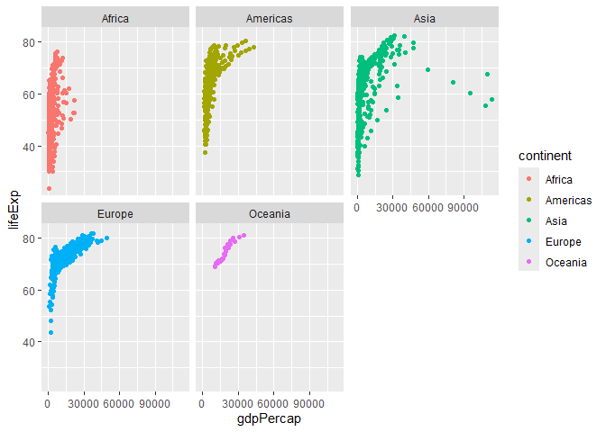
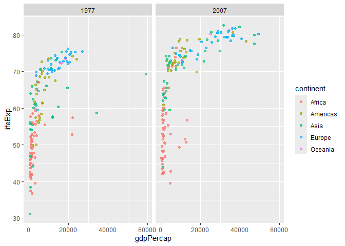

# Class 5: Data Viz with ggplot
Andrew Duong (PID: A18129684)

- [Background](#background)
- [Gene Expression Plot](#gene-expression-plot)
- [Going further with gapminder](#going-further-with-gapminder)
- [First Look at the dplyr package](#first-look-at-the-dplyr-package)

## Background

There are lot’s of ways to make plots in R. These include so-called
“base R” (like the `plot()`) and add on packages like **ggplot2**.

Let’s make the same plot with these two graphics systems. We can use the
inbuilt `cars` dataset:

``` r
plot(cars)
```


Now let’s try ggplot. First I need to install the package using
`install.packages("ggplot2")`

> **N.B.** We never run an install.packages in a code chunk otherwise we
> will re-install needlessly every time we redner our document.

Everytime we want to use an add-on package we need to load it up with a
call to `library()`

``` r
library(ggplot2)
ggplot(cars)
```


Every ggplot needs at least 3 things:

1.  The **data** i.e. stuff to plot as a data.frame
2.  The **aes** or aesthetics that map the data to the plot
3.  The **geom\_** or geometry i.e. the plot type such as points, line
    etc.

``` r
ggplot(cars) +
  aes(x=speed, y = dist) +
  geom_point() +
  geom_smooth(method = "lm", se = FALSE) +
  labs(x = "Speed (MPH)",
       y= "Distance (ft)",
       title = "Stopping Distance of old Cars") +
  theme_bw()
```

    `geom_smooth()` using formula = 'y ~ x'



## Gene Expression Plot

Read some data on the effects of GLP-1 inhbitor (drug) on gene
expression values:

``` r
url <- "https://bioboot.github.io/bimm143_S20/class-material/up_down_expression.txt"
genes <- read.delim(url)
head(genes)
```

            Gene Condition1 Condition2      State
    1      A4GNT -3.6808610 -3.4401355 unchanging
    2       AAAS  4.5479580  4.3864126 unchanging
    3      AASDH  3.7190695  3.4787276 unchanging
    4       AATF  5.0784720  5.0151916 unchanging
    5       AATK  0.4711421  0.5598642 unchanging
    6 AB015752.4 -3.6808610 -3.5921390 unchanging

Version 1 plot - start simple by getting some ink on the page.

``` r
ggplot(genes) +
  aes(Condition1, Condition2, col = "blue") + 
  geom_point(col= "blue", alpha = 0.2)
```



Let’s color by `State` up, down or no change.

``` r
table(genes$State)
```


          down unchanging         up 
            72       4997        127 

``` r
ggplot(genes) +
  aes(Condition1, Condition2, col = State) +
  geom_point() +
  scale_color_manual(values = c("purple", 
                                "green",
                                "blue")) +
  theme_grey() + 
  labs(title="Gene Expresion Changes Upon Drug Treatment",
         x = "Control (no drug) ",
         y = "Drug Treatment")
```



## Going further with gapminder

Here we explore the famous `gapmider` dataset with some custom plots.’

``` r
# File location online
url <- "https://raw.githubusercontent.com/jennybc/gapminder/master/inst/extdata/gapminder.tsv"

gapminder <- read.delim(url)
head(gapminder)
```

          country continent year lifeExp      pop gdpPercap
    1 Afghanistan      Asia 1952  28.801  8425333  779.4453
    2 Afghanistan      Asia 1957  30.332  9240934  820.8530
    3 Afghanistan      Asia 1962  31.997 10267083  853.1007
    4 Afghanistan      Asia 1967  34.020 11537966  836.1971
    5 Afghanistan      Asia 1972  36.088 13079460  739.9811
    6 Afghanistan      Asia 1977  38.438 14880372  786.1134

> Q. How many rows does this dataset have?

``` r
nrow(gapminder)
```

    [1] 1704

> How many diffreent continents are in this dataset?

``` r
table(gapminder$continent)
```


      Africa Americas     Asia   Europe  Oceania 
         624      300      396      360       24 

Version 1 plot gdpPercap vs Life Exp for all rows

``` r
ggplot(gapminder) +
  aes(gdpPercap, lifeExp, col=continent) +
  geom_point() +
  facet_wrap(~continent)
```



I want to see a plot for each continent - in ggplot lingo this is called
“faceting”

## First Look at the dplyr package

Another add-on package with a function called `filter()` that we want to
use.

``` r
library(dplyr)
```


    Attaching package: 'dplyr'

    The following objects are masked from 'package:stats':

        filter, lag

    The following objects are masked from 'package:base':

        intersect, setdiff, setequal, union

``` r
filter(gapminder, year == 2007, country == "China")
```

      country continent year lifeExp        pop gdpPercap
    1   China      Asia 2007  72.961 1318683096  4959.115

``` r
filter(gapminder, year == 2007 | year == 1977)
```

                         country continent year  lifeExp        pop  gdpPercap
    1                Afghanistan      Asia 1977 38.43800   14880372   786.1134
    2                Afghanistan      Asia 2007 43.82800   31889923   974.5803
    3                    Albania    Europe 1977 68.93000    2509048  3533.0039
    4                    Albania    Europe 2007 76.42300    3600523  5937.0295
    5                    Algeria    Africa 1977 58.01400   17152804  4910.4168
    6                    Algeria    Africa 2007 72.30100   33333216  6223.3675
    7                     Angola    Africa 1977 39.48300    6162675  3008.6474
    8                     Angola    Africa 2007 42.73100   12420476  4797.2313
    9                  Argentina  Americas 1977 68.48100   26983828 10079.0267
    10                 Argentina  Americas 2007 75.32000   40301927 12779.3796
    11                 Australia   Oceania 1977 73.49000   14074100 18334.1975
    12                 Australia   Oceania 2007 81.23500   20434176 34435.3674
    13                   Austria    Europe 1977 72.17000    7568430 19749.4223
    14                   Austria    Europe 2007 79.82900    8199783 36126.4927
    15                   Bahrain      Asia 1977 65.59300     297410 19340.1020
    16                   Bahrain      Asia 2007 75.63500     708573 29796.0483
    17                Bangladesh      Asia 1977 46.92300   80428306   659.8772
    18                Bangladesh      Asia 2007 64.06200  150448339  1391.2538
    19                   Belgium    Europe 1977 72.80000    9821800 19117.9745
    20                   Belgium    Europe 2007 79.44100   10392226 33692.6051
    21                     Benin    Africa 1977 49.19000    3168267  1029.1613
    22                     Benin    Africa 2007 56.72800    8078314  1441.2849
    23                   Bolivia  Americas 1977 50.02300    5079716  3548.0978
    24                   Bolivia  Americas 2007 65.55400    9119152  3822.1371
    25    Bosnia and Herzegovina    Europe 1977 69.86000    4086000  3528.4813
    26    Bosnia and Herzegovina    Europe 2007 74.85200    4552198  7446.2988
    27                  Botswana    Africa 1977 59.31900     781472  3214.8578
    28                  Botswana    Africa 2007 50.72800    1639131 12569.8518
    29                    Brazil  Americas 1977 61.48900  114313951  6660.1187
    30                    Brazil  Americas 2007 72.39000  190010647  9065.8008
    31                  Bulgaria    Europe 1977 70.81000    8797022  7612.2404
    32                  Bulgaria    Europe 2007 73.00500    7322858 10680.7928
    33              Burkina Faso    Africa 1977 46.13700    5889574   743.3870
    34              Burkina Faso    Africa 2007 52.29500   14326203  1217.0330
    35                   Burundi    Africa 1977 45.91000    3834415   556.1033
    36                   Burundi    Africa 2007 49.58000    8390505   430.0707
    37                  Cambodia      Asia 1977 31.22000    6978607   524.9722
    38                  Cambodia      Asia 2007 59.72300   14131858  1713.7787
    39                  Cameroon    Africa 1977 49.35500    7959865  1783.4329
    40                  Cameroon    Africa 2007 50.43000   17696293  2042.0952
    41                    Canada  Americas 1977 74.21000   23796400 22090.8831
    42                    Canada  Americas 2007 80.65300   33390141 36319.2350
    43  Central African Republic    Africa 1977 46.77500    2167533  1109.3743
    44  Central African Republic    Africa 2007 44.74100    4369038   706.0165
    45                      Chad    Africa 1977 47.38300    4388260  1133.9850
    46                      Chad    Africa 2007 50.65100   10238807  1704.0637
    47                     Chile  Americas 1977 67.05200   10599793  4756.7638
    48                     Chile  Americas 2007 78.55300   16284741 13171.6388
    49                     China      Asia 1977 63.96736  943455000   741.2375
    50                     China      Asia 2007 72.96100 1318683096  4959.1149
    51                  Colombia  Americas 1977 63.83700   25094412  3815.8079
    52                  Colombia  Americas 2007 72.88900   44227550  7006.5804
    53                   Comoros    Africa 1977 50.93900     304739  1172.6030
    54                   Comoros    Africa 2007 65.15200     710960   986.1479
    55          Congo, Dem. Rep.    Africa 1977 47.80400   26480870   795.7573
    56          Congo, Dem. Rep.    Africa 2007 46.46200   64606759   277.5519
    57               Congo, Rep.    Africa 1977 55.62500    1536769  3259.1790
    58               Congo, Rep.    Africa 2007 55.32200    3800610  3632.5578
    59                Costa Rica  Americas 1977 70.75000    2108457  5926.8770
    60                Costa Rica  Americas 2007 78.78200    4133884  9645.0614
    61             Cote d'Ivoire    Africa 1977 52.37400    7459574  2517.7365
    62             Cote d'Ivoire    Africa 2007 48.32800   18013409  1544.7501
    63                   Croatia    Europe 1977 70.64000    4318673 11305.3852
    64                   Croatia    Europe 2007 75.74800    4493312 14619.2227
    65                      Cuba  Americas 1977 72.64900    9537988  6380.4950
    66                      Cuba  Americas 2007 78.27300   11416987  8948.1029
    67            Czech Republic    Europe 1977 70.71000   10161915 14800.1606
    68            Czech Republic    Europe 2007 76.48600   10228744 22833.3085
    69                   Denmark    Europe 1977 74.69000    5088419 20422.9015
    70                   Denmark    Europe 2007 78.33200    5468120 35278.4187
    71                  Djibouti    Africa 1977 46.51900     228694  3081.7610
    72                  Djibouti    Africa 2007 54.79100     496374  2082.4816
    73        Dominican Republic  Americas 1977 61.78800    5302800  2681.9889
    74        Dominican Republic  Americas 2007 72.23500    9319622  6025.3748
    75                   Ecuador  Americas 1977 61.31000    7278866  6679.6233
    76                   Ecuador  Americas 2007 74.99400   13755680  6873.2623
    77                     Egypt    Africa 1977 53.31900   38783863  2785.4936
    78                     Egypt    Africa 2007 71.33800   80264543  5581.1810
    79               El Salvador  Americas 1977 56.69600    4282586  5138.9224
    80               El Salvador  Americas 2007 71.87800    6939688  5728.3535
    81         Equatorial Guinea    Africa 1977 42.02400     192675   958.5668
    82         Equatorial Guinea    Africa 2007 51.57900     551201 12154.0897
    83                   Eritrea    Africa 1977 44.53500    2512642   505.7538
    84                   Eritrea    Africa 2007 58.04000    4906585   641.3695
    85                  Ethiopia    Africa 1977 44.51000   34617799   556.8084
    86                  Ethiopia    Africa 2007 52.94700   76511887   690.8056
    87                   Finland    Europe 1977 72.52000    4738902 15605.4228
    88                   Finland    Europe 2007 79.31300    5238460 33207.0844
    89                    France    Europe 1977 73.83000   53165019 18292.6351
    90                    France    Europe 2007 80.65700   61083916 30470.0167
    91                     Gabon    Africa 1977 52.79000     706367 21745.5733
    92                     Gabon    Africa 2007 56.73500    1454867 13206.4845
    93                    Gambia    Africa 1977 41.84200     608274   884.7553
    94                    Gambia    Africa 2007 59.44800    1688359   752.7497
    95                   Germany    Europe 1977 72.50000   78160773 20512.9212
    96                   Germany    Europe 2007 79.40600   82400996 32170.3744
    97                     Ghana    Africa 1977 51.75600   10538093   993.2240
    98                     Ghana    Africa 2007 60.02200   22873338  1327.6089
    99                    Greece    Europe 1977 73.68000    9308479 14195.5243
    100                   Greece    Europe 2007 79.48300   10706290 27538.4119
    101                Guatemala  Americas 1977 56.02900    5703430  4879.9927
    102                Guatemala  Americas 2007 70.25900   12572928  5186.0500
    103                   Guinea    Africa 1977 40.76200    4227026   874.6859
    104                   Guinea    Africa 2007 56.00700    9947814   942.6542
    105            Guinea-Bissau    Africa 1977 37.46500     745228   764.7260
    106            Guinea-Bissau    Africa 2007 46.38800    1472041   579.2317
    107                    Haiti  Americas 1977 49.92300    4908554  1874.2989
    108                    Haiti  Americas 2007 60.91600    8502814  1201.6372
    109                 Honduras  Americas 1977 57.40200    3055235  3203.2081
    110                 Honduras  Americas 2007 70.19800    7483763  3548.3308
    111         Hong Kong, China      Asia 1977 73.60000    4583700 11186.1413
    112         Hong Kong, China      Asia 2007 82.20800    6980412 39724.9787
    113                  Hungary    Europe 1977 69.95000   10637171 11674.8374
    114                  Hungary    Europe 2007 73.33800    9956108 18008.9444
    115                  Iceland    Europe 1977 76.11000     221823 19654.9625
    116                  Iceland    Europe 2007 81.75700     301931 36180.7892
    117                    India      Asia 1977 54.20800  634000000   813.3373
    118                    India      Asia 2007 64.69800 1110396331  2452.2104
    119                Indonesia      Asia 1977 52.70200  136725000  1382.7021
    120                Indonesia      Asia 2007 70.65000  223547000  3540.6516
    121                     Iran      Asia 1977 57.70200   35480679 11888.5951
    122                     Iran      Asia 2007 70.96400   69453570 11605.7145
    123                     Iraq      Asia 1977 60.41300   11882916 14688.2351
    124                     Iraq      Asia 2007 59.54500   27499638  4471.0619
    125                  Ireland    Europe 1977 72.03000    3271900 11150.9811
    126                  Ireland    Europe 2007 78.88500    4109086 40675.9964
    127                   Israel      Asia 1977 73.06000    3495918 13306.6192
    128                   Israel      Asia 2007 80.74500    6426679 25523.2771
    129                    Italy    Europe 1977 73.48000   56059245 14255.9847
    130                    Italy    Europe 2007 80.54600   58147733 28569.7197
    131                  Jamaica  Americas 1977 70.11000    2156814  6650.1956
    132                  Jamaica  Americas 2007 72.56700    2780132  7320.8803
    133                    Japan      Asia 1977 75.38000  113872473 16610.3770
    134                    Japan      Asia 2007 82.60300  127467972 31656.0681
    135                   Jordan      Asia 1977 61.13400    1937652  2852.3516
    136                   Jordan      Asia 2007 72.53500    6053193  4519.4612
    137                    Kenya    Africa 1977 56.15500   14500404  1267.6132
    138                    Kenya    Africa 2007 54.11000   35610177  1463.2493
    139         Korea, Dem. Rep.      Asia 1977 67.15900   16325320  4106.3012
    140         Korea, Dem. Rep.      Asia 2007 67.29700   23301725  1593.0655
    141              Korea, Rep.      Asia 1977 64.76600   36436000  4657.2210
    142              Korea, Rep.      Asia 2007 78.62300   49044790 23348.1397
    143                   Kuwait      Asia 1977 69.34300    1140357 59265.4771
    144                   Kuwait      Asia 2007 77.58800    2505559 47306.9898
    145                  Lebanon      Asia 1977 66.09900    3115787  8659.6968
    146                  Lebanon      Asia 2007 71.99300    3921278 10461.0587
    147                  Lesotho    Africa 1977 52.20800    1251524   745.3695
    148                  Lesotho    Africa 2007 42.59200    2012649  1569.3314
    149                  Liberia    Africa 1977 43.76400    1703617   640.3224
    150                  Liberia    Africa 2007 45.67800    3193942   414.5073
    151                    Libya    Africa 1977 57.44200    2721783 21951.2118
    152                    Libya    Africa 2007 73.95200    6036914 12057.4993
    153               Madagascar    Africa 1977 46.88100    8007166  1544.2286
    154               Madagascar    Africa 2007 59.44300   19167654  1044.7701
    155                   Malawi    Africa 1977 43.76700    5637246   663.2237
    156                   Malawi    Africa 2007 48.30300   13327079   759.3499
    157                 Malaysia      Asia 1977 65.25600   12845381  3827.9216
    158                 Malaysia      Asia 2007 74.24100   24821286 12451.6558
    159                     Mali    Africa 1977 41.71400    6491649   686.3953
    160                     Mali    Africa 2007 54.46700   12031795  1042.5816
    161               Mauritania    Africa 1977 50.85200    1456688  1497.4922
    162               Mauritania    Africa 2007 64.16400    3270065  1803.1515
    163                Mauritius    Africa 1977 64.93000     913025  3710.9830
    164                Mauritius    Africa 2007 72.80100    1250882 10956.9911
    165                   Mexico  Americas 1977 65.03200   63759976  7674.9291
    166                   Mexico  Americas 2007 76.19500  108700891 11977.5750
    167                 Mongolia      Asia 1977 55.49100    1528000  1647.5117
    168                 Mongolia      Asia 2007 66.80300    2874127  3095.7723
    169               Montenegro    Europe 1977 73.06600     560073  9595.9299
    170               Montenegro    Europe 2007 74.54300     684736  9253.8961
    171                  Morocco    Africa 1977 55.73000   18396941  2370.6200
    172                  Morocco    Africa 2007 71.16400   33757175  3820.1752
    173               Mozambique    Africa 1977 42.49500   11127868   502.3197
    174               Mozambique    Africa 2007 42.08200   19951656   823.6856
    175                  Myanmar      Asia 1977 56.05900   31528087   371.0000
    176                  Myanmar      Asia 2007 62.06900   47761980   944.0000
    177                  Namibia    Africa 1977 56.43700     977026  3876.4860
    178                  Namibia    Africa 2007 52.90600    2055080  4811.0604
    179                    Nepal      Asia 1977 46.74800   13933198   694.1124
    180                    Nepal      Asia 2007 63.78500   28901790  1091.3598
    181              Netherlands    Europe 1977 75.24000   13852989 21209.0592
    182              Netherlands    Europe 2007 79.76200   16570613 36797.9333
    183              New Zealand   Oceania 1977 72.22000    3164900 16233.7177
    184              New Zealand   Oceania 2007 80.20400    4115771 25185.0091
    185                Nicaragua  Americas 1977 57.47000    2554598  5486.3711
    186                Nicaragua  Americas 2007 72.89900    5675356  2749.3210
    187                    Niger    Africa 1977 41.29100    5682086   808.8971
    188                    Niger    Africa 2007 56.86700   12894865   619.6769
    189                  Nigeria    Africa 1977 44.51400   62209173  1981.9518
    190                  Nigeria    Africa 2007 46.85900  135031164  2013.9773
    191                   Norway    Europe 1977 75.37000    4043205 23311.3494
    192                   Norway    Europe 2007 80.19600    4627926 49357.1902
    193                     Oman      Asia 1977 57.36700    1004533 11848.3439
    194                     Oman      Asia 2007 75.64000    3204897 22316.1929
    195                 Pakistan      Asia 1977 54.04300   78152686  1175.9212
    196                 Pakistan      Asia 2007 65.48300  169270617  2605.9476
    197                   Panama  Americas 1977 68.68100    1839782  5351.9121
    198                   Panama  Americas 2007 75.53700    3242173  9809.1856
    199                 Paraguay  Americas 1977 66.35300    2984494  3248.3733
    200                 Paraguay  Americas 2007 71.75200    6667147  4172.8385
    201                     Peru  Americas 1977 58.44700   15990099  6281.2909
    202                     Peru  Americas 2007 71.42100   28674757  7408.9056
    203              Philippines      Asia 1977 60.06000   46850962  2373.2043
    204              Philippines      Asia 2007 71.68800   91077287  3190.4810
    205                   Poland    Europe 1977 70.67000   34621254  9508.1415
    206                   Poland    Europe 2007 75.56300   38518241 15389.9247
    207                 Portugal    Europe 1977 70.41000    9662600 10172.4857
    208                 Portugal    Europe 2007 78.09800   10642836 20509.6478
    209              Puerto Rico  Americas 1977 73.44000    3080828  9770.5249
    210              Puerto Rico  Americas 2007 78.74600    3942491 19328.7090
    211                  Reunion    Africa 1977 67.06400     492095  4319.8041
    212                  Reunion    Africa 2007 76.44200     798094  7670.1226
    213                  Romania    Europe 1977 69.46000   21658597  9356.3972
    214                  Romania    Europe 2007 72.47600   22276056 10808.4756
    215                   Rwanda    Africa 1977 45.00000    4657072   670.0806
    216                   Rwanda    Africa 2007 46.24200    8860588   863.0885
    217    Sao Tome and Principe    Africa 1977 58.55000      86796  1737.5617
    218    Sao Tome and Principe    Africa 2007 65.52800     199579  1598.4351
    219             Saudi Arabia      Asia 1977 58.69000    8128505 34167.7626
    220             Saudi Arabia      Asia 2007 72.77700   27601038 21654.8319
    221                  Senegal    Africa 1977 48.87900    5260855  1561.7691
    222                  Senegal    Africa 2007 63.06200   12267493  1712.4721
    223                   Serbia    Europe 1977 70.30000    8686367 12980.6696
    224                   Serbia    Europe 2007 74.00200   10150265  9786.5347
    225             Sierra Leone    Africa 1977 36.78800    3140897  1348.2852
    226             Sierra Leone    Africa 2007 42.56800    6144562   862.5408
    227                Singapore      Asia 1977 70.79500    2325300 11210.0895
    228                Singapore      Asia 2007 79.97200    4553009 47143.1796
    229          Slovak Republic    Europe 1977 70.45000    4827803 10922.6640
    230          Slovak Republic    Europe 2007 74.66300    5447502 18678.3144
    231                 Slovenia    Europe 1977 70.97000    1746919 15277.0302
    232                 Slovenia    Europe 2007 77.92600    2009245 25768.2576
    233                  Somalia    Africa 1977 41.97400    4353666  1450.9925
    234                  Somalia    Africa 2007 48.15900    9118773   926.1411
    235             South Africa    Africa 1977 55.52700   27129932  8028.6514
    236             South Africa    Africa 2007 49.33900   43997828  9269.6578
    237                    Spain    Europe 1977 74.39000   36439000 13236.9212
    238                    Spain    Europe 2007 80.94100   40448191 28821.0637
    239                Sri Lanka      Asia 1977 65.94900   14116836  1348.7757
    240                Sri Lanka      Asia 2007 72.39600   20378239  3970.0954
    241                    Sudan    Africa 1977 47.80000   17104986  2202.9884
    242                    Sudan    Africa 2007 58.55600   42292929  2602.3950
    243                Swaziland    Africa 1977 52.53700     551425  3781.4106
    244                Swaziland    Africa 2007 39.61300    1133066  4513.4806
    245                   Sweden    Europe 1977 75.44000    8251648 18855.7252
    246                   Sweden    Europe 2007 80.88400    9031088 33859.7484
    247              Switzerland    Europe 1977 75.39000    6316424 26982.2905
    248              Switzerland    Europe 2007 81.70100    7554661 37506.4191
    249                    Syria      Asia 1977 61.19500    7932503  3195.4846
    250                    Syria      Asia 2007 74.14300   19314747  4184.5481
    251                   Taiwan      Asia 1977 70.59000   16785196  5596.5198
    252                   Taiwan      Asia 2007 78.40000   23174294 28718.2768
    253                 Tanzania    Africa 1977 49.91900   17129565   962.4923
    254                 Tanzania    Africa 2007 52.51700   38139640  1107.4822
    255                 Thailand      Asia 1977 62.49400   44148285  1961.2246
    256                 Thailand      Asia 2007 70.61600   65068149  7458.3963
    257                     Togo    Africa 1977 52.88700    2308582  1532.7770
    258                     Togo    Africa 2007 58.42000    5701579   882.9699
    259      Trinidad and Tobago  Americas 1977 68.30000    1039009  7899.5542
    260      Trinidad and Tobago  Americas 2007 69.81900    1056608 18008.5092
    261                  Tunisia    Africa 1977 59.83700    6005061  3120.8768
    262                  Tunisia    Africa 2007 73.92300   10276158  7092.9230
    263                   Turkey    Europe 1977 59.50700   42404033  4269.1223
    264                   Turkey    Europe 2007 71.77700   71158647  8458.2764
    265                   Uganda    Africa 1977 50.35000   11457758   843.7331
    266                   Uganda    Africa 2007 51.54200   29170398  1056.3801
    267           United Kingdom    Europe 1977 72.76000   56179000 17428.7485
    268           United Kingdom    Europe 2007 79.42500   60776238 33203.2613
    269            United States  Americas 1977 73.38000  220239000 24072.6321
    270            United States  Americas 2007 78.24200  301139947 42951.6531
    271                  Uruguay  Americas 1977 69.48100    2873520  6504.3397
    272                  Uruguay  Americas 2007 76.38400    3447496 10611.4630
    273                Venezuela  Americas 1977 67.45600   13503563 13143.9510
    274                Venezuela  Americas 2007 73.74700   26084662 11415.8057
    275                  Vietnam      Asia 1977 55.76400   50533506   713.5371
    276                  Vietnam      Asia 2007 74.24900   85262356  2441.5764
    277       West Bank and Gaza      Asia 1977 60.76500    1261091  3682.8315
    278       West Bank and Gaza      Asia 2007 73.42200    4018332  3025.3498
    279              Yemen, Rep.      Asia 1977 44.17500    8403990  1829.7652
    280              Yemen, Rep.      Asia 2007 62.69800   22211743  2280.7699
    281                   Zambia    Africa 1977 51.38600    5216550  1588.6883
    282                   Zambia    Africa 2007 42.38400   11746035  1271.2116
    283                 Zimbabwe    Africa 1977 57.67400    6642107   685.5877
    284                 Zimbabwe    Africa 2007 43.48700   12311143   469.7093

``` r
gapminder_1977 <- gapminder %>% filter(year==1977 | year==2007)

ggplot(gapminder_1977) + 
  geom_point(aes(x = gdpPercap, y = lifeExp, color=continent
          ), alpha=0.7) + 
  scale_size_area(max_size = 10) +
  facet_wrap(~year)
```


